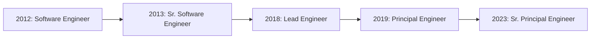

# Hi there, I'm Gowthaman Thangavel 👋

<div align="center">
  
[](https://linkedin.com/in/gowthaman-thangavel)
[](https://github.com/gowthamand7)
[](mailto:gowthamand7@gmail.com)

</div>

## 🚀 About Me

Senior Principal Engineer with **12+ years** of experience crafting scalable backend systems and cloud-native microservices. I'm passionate about building high-performance distributed systems that serve millions of users.

- 🔭 Currently working on AI agents and distributed systems at **SysCloud Inc**
- 🌱 Exploring **AI/ML, LangGraph, and Model Context Protocol (MCP)**
- 💡 Co-architected a backup security product serving **6M+ users**
- 🤖 Built AI agents that reduced engineering tickets by **70%**
- 📉 Led AWS cost optimization achieving **30% reduction** in infrastructure costs
- 📍 Based in **Atlanta, GA**

## 💻 Tech Stack

### Languages


### Cloud & Infrastructure


### Databases & Caching


### Message Queues & Streaming


### Monitoring & Observability


### AI & Emerging Tech


## 🏆 Key Achievements

```go
achievements := map[string]string{
    "🎯 Performance":      "30% DB efficiency gain with DynamoDB optimization",
    "🔒 Security":         "Client-side encryption for 6M+ users",
    "🤖 AI Innovation":    "4+ AI agents reducing manual workload by 60-70%",
    "💰 Cost Savings":     "35% storage cost reduction via intelligent tiering",
    "📈 Scalability":      "900% throughput increase (100K → 1M emails/day)",
    "⚡ Optimization":     "50-60% reduction in DB hits with Bloom filters",
}
```

## 🔥 Recent Projects

### 🤖 AI Agents & Automation
Built multiple AI agents using LangFlow and LangChain:
- Internal support chatbot with knowledge base integration
- Automated monitoring reports
- Level 1 PR review automation
- Slack/Teams integrated application chatbot

### 🔐 Enterprise Security
- **Client-Side Encryption**: End-to-end encryption using tenant-based KMS keys
- **OAuth2/OIDC**: Serving 6M+ users with zero cross-tenant security incidents
- **DLP Scanning**: Compliance scanning for FERPA, HIPAA, PCI standards

### 🏗️ Infrastructure & Architecture
- **Multi-tenant Orchestrator**: Secure tenant isolation using Go goroutines
- **Rate Limiting Framework**: Maintained p95 < 500ms latency
- **Microservices Migration**: Monolith to microservices achieving 40% performance boost

## 📊 GitHub Stats

<div align="center">
  


</div>

## 🎓 Experience Timeline



## 📫 Let's Connect!

I'm always interested in discussing:
- 🏗️ Distributed systems architecture
- 🤖 AI/ML and AI agents
- ☁️ Cloud-native solutions
- 🚀 Performance optimization
- 👥 Technical leadership

Feel free to reach out for collaborations, tech discussions, or just to say hi!

---

<div align="center">
  
**💼 Open to interesting opportunities and collaborations**

⭐️ From [gowthamand7](https://github.com/gowthamand7)

</div>
